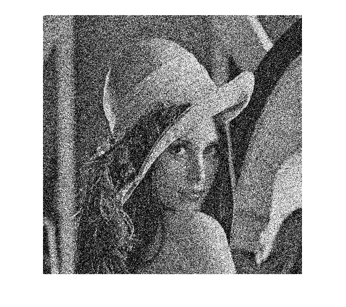
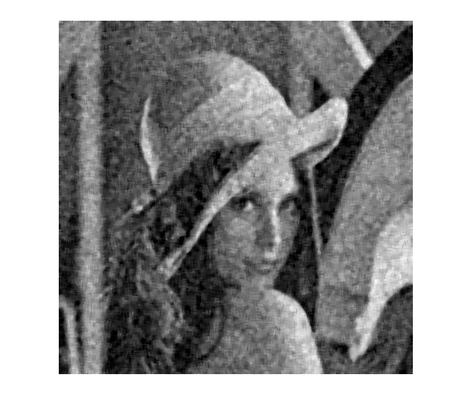
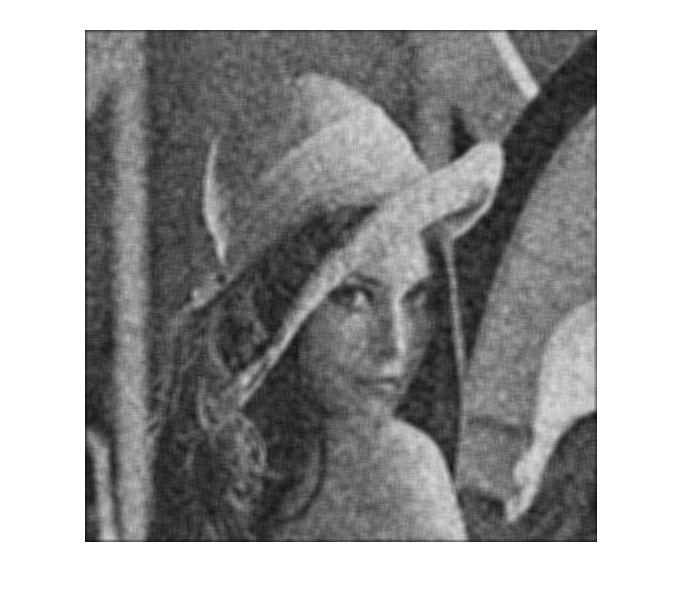
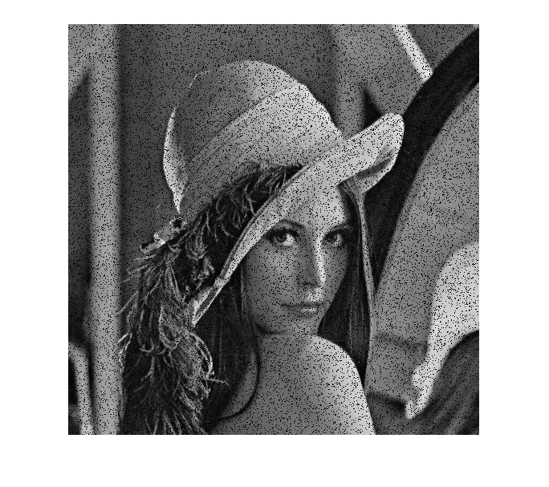
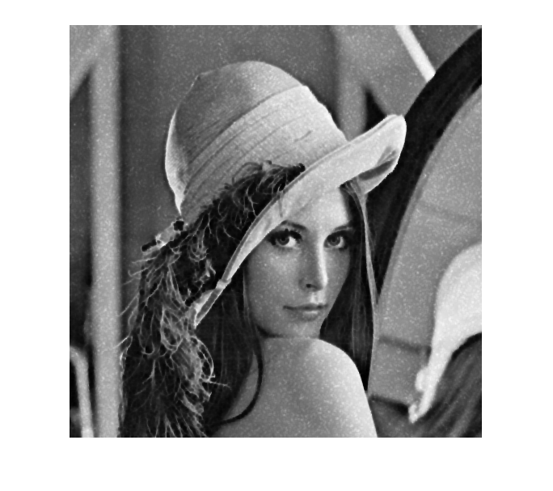
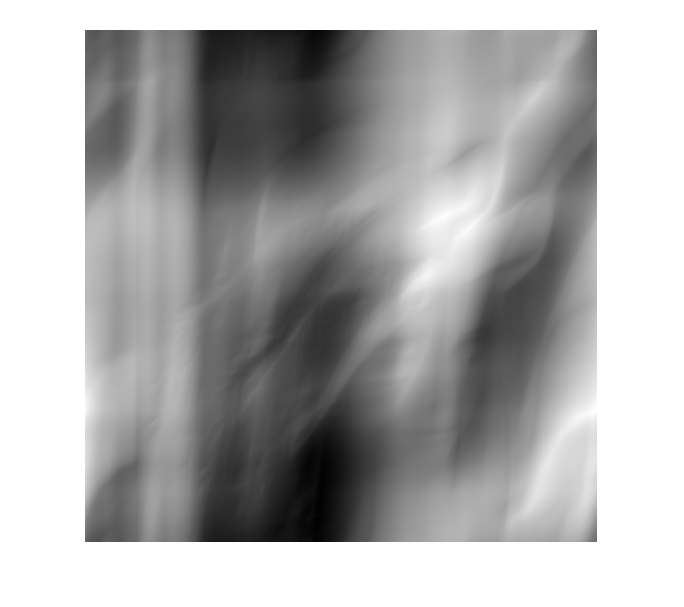
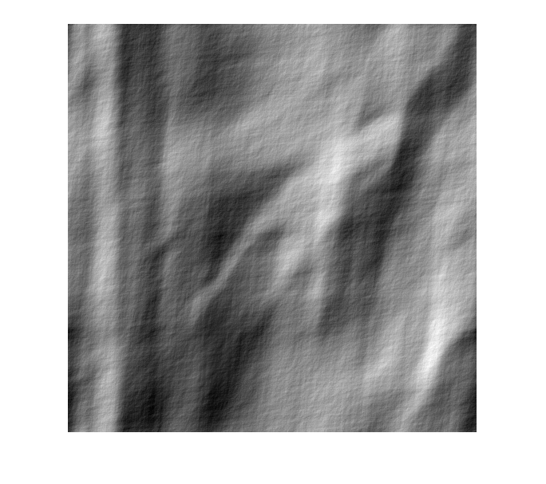

数字图像处理实验报告

自动化64               2160504103           魏慎行

摘要

   本次作业使用MATLAB对所给图像文件的相关处理：1.在测试图像上产生高斯噪声lena图-需能指定均值和方差；并用滤波器恢复图像；2.实现下边要求；(a) 实现模糊滤波器如方程Eq. (5.6-11) ；(b) 模糊lena图像：45度方向，T=1；(c) 在模糊的lena图像中增加高斯噪声，均值= 0 ，方差=10 pixels 以产生退化图像；(d)分别利用方程 Eq. (5.8-6)和(5.9-4)，恢复图像。以上任务完成后均得到了预期的结果。  

**1.在测试图像上产生高斯噪声lena图-需能指定均值和方差；并用多种滤波器恢复图像，分析各自优缺点；**  
 在MATLAB中调用imnoise函数可以添加高斯噪声
 实验结果如下：  
   高斯噪声：  方差0.01，均值0  
     
   中值滤波：  
     
   算术均值滤波：  
      
 滤波分析：  
   计算速度较快，中值滤波亮度较强，对图像边缘保护较好，算数均值滤波则较为边缘较模糊，但清晰度相对较高。  
**2.在测试图像lena图加入椒盐噪声（椒和盐噪声密度均是0.1）；用学过的滤波器恢复图像；在使用反谐波分析Q大于0和小于0的作用；**  
 椒盐噪声使用自己写的函数，可以分别添加椒噪声和盐噪声。原理为在每一行随机抽取像素将其灰度值改为0或255.  
 反谐波滤波器使用自己编写的函数，Q>0适合滤除胡椒噪声，Q<0适合滤除盐噪声。  
   椒噪声：  

     
   盐噪声:  

       

   反谐波滤波器滤波结果：  
   **Q>0:**  

     

   **Q<0:**  

     

***实验分析：**  
从图像处理结果来看反谐波滤波器在Q>0和Q<0时分别对胡椒噪声和盐噪声滤波具有相当好的效果。  

**3.推导维纳滤波器并实现下边要求；**  
(a) 实现模糊滤波器如方程Eq. (5.6-11). 
(b) 模糊lena图像：45度方向，T=1；  
(c) 再模糊的lena图像中增加高斯噪声，均值= 0 ，方差=10 pixels 以产生模糊图像；  
(d)分别利用方程 Eq. (5.8-6)和(5.9-4)，恢复图像；并分析算法的优缺点.
  
(a)令传递函数H(u,v)=T/(π*(u*a+v*b))*sin[π*(a*u+b*v)]*e^(jπ(u*a+v*b))即可  
(b)利用H(u,v)图像进行频域阵列相乘可以得到模糊图像其中a=b=0.01,T=1;  
结果如下图：  
  

(c)利用imnoise函数生成高斯噪声，z=0,τ=0.01.  
结果如下图：  
  

(d)维纳滤波使用自编函数，按照程 Eq. (5.8-6)编辑H(u,v)即可。
  由于存在参数K，所以对K值范围进行了测试，选取MSE作为最佳K值标准，最终得到K值取0.016，本次实验中最终选取K=0.016；  
  维纳滤波结果如下图：  
    

  约束最小乘方滤波  
  使用MATLAB自带函数deconvreg()进行滤波  
  结果如下图：  
    

**比较分析**  
从两种滤波器结果来看约束最小乘方滤波取得了更好的结果，噪声基本能够得到消除图像变得模糊但是平滑。
